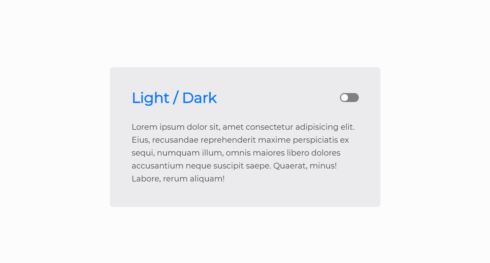

<h1 align="center">Dark Mode</h1>

<p align="center">Light and Dark Theme switcher</p>

<p align="center">
    <a href="https://github.com/diego-aquino">
        
    </a>
    
    <a>
        
    </a>
    <a href="./LICENSE">
        
    </a>
</p>

<p align="center">
    <a href="#gear-technologies">Technologies Used</a>&nbsp;&nbsp;&nbsp;|&nbsp;&nbsp;&nbsp;
    <a href="#computer-try-it-out">Try it Out!</a>&nbsp;&nbsp;&nbsp;|&nbsp;&nbsp;&nbsp;
    <a href="#newspaper_roll-license">License</a>
</p>



## :gear: Technologies

The main technologies used in this practice project are the following:

- [JavaScript](https://developer.mozilla.org/en-US/docs/Web/JavaScript) + [HTML](https://developer.mozilla.org/en-US/docs/Web/HTML) + [CSS](https://developer.mozilla.org/en-US/docs/Web/CSS)
- [ScreenToGif](https://www.screentogif.com/), used to record demonstration GIFs.

## :computer: Try it Out!

To clone and run this application, you'll need [Git](https://git-scm.com/) and [Node.js](https://nodejs.org/en/) installed on your computer. Then, from your command line:

```bash
# clone and access this repository
$ git clone https://github.com/diego-aquino/dark-mode.git
$ cd dark-mode/

# install http-server package (in order to start a local server)
$ npm install --global http-server

# start a local server
$ http-server
```

Now you can visit `http://localhost:8080` and switch themes!

## :newspaper_roll: License

This project if under MIT License. Check [LICENSE](./LICENSE) for more information.

## :handshake: Acknowledgments

Especial thanks to [@maykbrito](https://github.com/maykbrito) and [Rocketseat](https://rocketseat.com.br/) for the masterclass [Dark Mode raiz com CSS e JavaScript](https://www.youtube.com/watch?v=BvhYm0BOLvA). Your content is always outstanding!

---

Made by [Diego Aquino](https://github.com/diego-aquino/) :sunglasses:. [Connect with me!](https://www.linkedin.com/in/diego-aquino) :wave:
